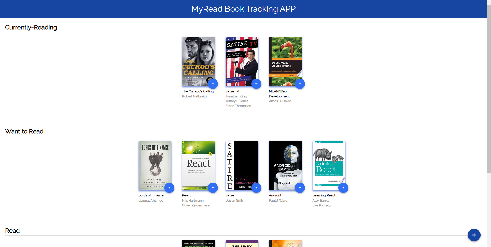
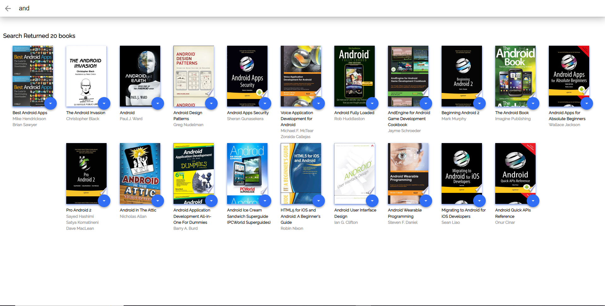

# MyRead_Book_Tracking_APP


MyRead_Book_Tracking_APP this course Do to Fwd React Cross Worker


## Project Purpose:

MyReads is a bookshelf app that allows us to select and categorize books that we have read, currently reading, or want to read. The project emphasizes using React Fundamentals to build the application and provides an API server and client library to persist information as we interact with the application.

## How to Load the App

The project uses Node.js and the Create-React-App starter.  If you do not have Node >= 6.x installed, you can download it here: [Node.js](https://nodejs.org/en/)

Once Node is installed, navigate to the directory where you want to save the app
```sh
git clone https://github.com/johnson3235/MyRead_Book_Tracking_APP
```
You can use ```npm``` package manager to install dependencies.
### ```npm install``` 

Once all of the dependencies have been installed you can launch the development server with

### ```npm start```  

A new browser window should automatically open displaying the app.  If it doesn't, navigate to [http://localhost:3000/](http://localhost:3000/) in your browser



## How to Use the App
* Books are sorted into three categories:
"Currently Reading", "Want to Read" and "Read".
* Every book features Light Blue button to change the shelf of the book. Setting option to none hides the book from the shelf.


* New Book can be added to the shelf using Dark Blue + button given at the bottom right corner.





*Note: The backend API is limited to a fixed set of [search terms](#search-terms)  -- see below for valid search options*
#### Search Terms
'Android', 'Art', 'Artificial Intelligence', 'Astronomy', 'Austen', 'Baseball', 'Basketball', 'Bhagat', 'Biography', 'Brief', 'Business', 'Camus', 'Cervantes', 'Christie', 'Classics', 'Comics', 'Cook', 'Cricket', 'Cycling', 'Desai', 'Design', 'Development', 'Digital Marketing', 'Drama', 'Drawing', 'Dumas', 'Education', 'Everything', 'Fantasy', 'Film', 'Finance', 'First', 'Fitness', 'Football', 'Future', 'Games', 'Gandhi', 'Homer', 'Horror', 'Hugo', 'Ibsen', 'Journey', 'Kafka', 'King', 'Lahiri', 'Larsson', 'Learn', 'Literary Fiction', 'Make', 'Manage', 'Marquez', 'Money', 'Mystery', 'Negotiate', 'Painting', 'Philosophy', 'Photography', 'Poetry', 'Production', 'Programming', 'React', 'Redux', 'River', 'Robotics', 'Rowling', 'Satire', 'Science Fiction', 'Shakespeare', 'Singh', 'Swimming', 'Tale', 'Thrun', 'Time', 'Tolstoy', 'Travel', 'Ultimate', 'Virtual Reality', 'Web Development', 'iOS'


